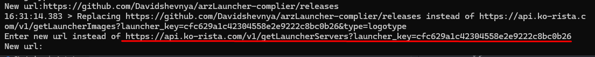
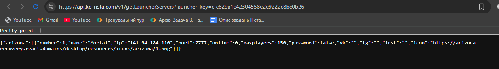
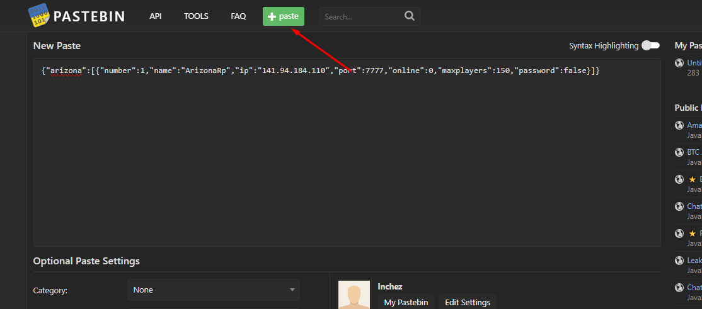
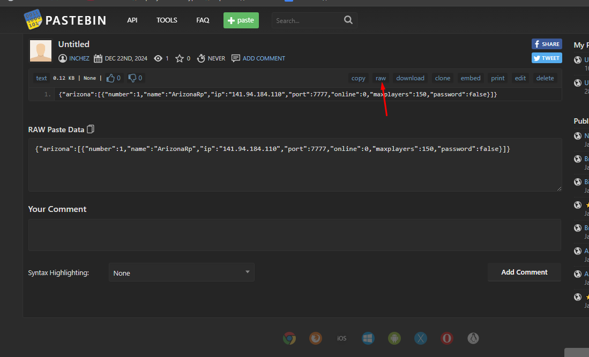

# Arizona Launcher Compiler
Прога написана на питоне, сделана специально для школьников у которых нету денег на лаунчер. Сейчас прога работает только с асаром от користы и суворова, ориг аризона возможно будет добавлена в будущем.

# Установка и запуск приложения
## Шаг 1. Установите Python3
 Сделайте это либо на офф. [сайте](https://python.org) либо в [Microsoft Store](ms-windows-store://pdp?hl=uk-ua&gl=us&referrer=storeforweb&source=https%3A%2F%2Fapps.microsoft.com%2Fdetail%2F9ncvdn91xzqp%3Fhl%3Den-US%26gl%3DUS&productid=9ncvdn91xzqp&storecid=storeweb-pdp-open-cta&webid=f8e7e7bf-2ca3-489e-80aa-515bd872be7c&websessionid=7b73c923-0511-4cf6-aba6-b4fd22da6a44).
## Шаг 2. Скачайте проект
Для начала нужно скачать проект, это можно сделать по этой [ссылке](https://github.com/Davidshevnya/arzLauncher-complier/archive/refs/heads/main.zip).
Разархивируйте его в любое для вас удобное место, а затем откройте его.
## Шаг 3. Подготовьте app.asar
После этого вам нужен app.asar от лаунчера Користы или Суворова (на данный момент работают только они), можете скачать их [здесь](https://github.com/Davidshevnya/arzLauncher-complier/releases).
<br>Данный файл нужно переместить в папку с файлом main.py.
Вот как это должно выглядеть: 
## Шаг 4. Установка зависимостей и запуск main.py
Откройте командную строку в папке проекта и пропишите две следующих  команды: <br>
### ```pip install -r requirements. txt```<br>
### ```python main.py app.asar```

## Шаг 5. Выберите тип лаунчера и укажите ссылки

Если у вас app.asar от лаунчера користы, то указывайте 1 в ином случае 2. Ориг арз пока что в разработке. 
### Какие ссылки нужно указывать?
Смотря чей app.asar.
<br> Для примера покажу на app.asar`е от користы.
Сначала программа заменяет ссылки в стилях лаунчера.
На скрине ниже можем видеть, что программа просит ввести новую ссылку заместь <br>https://api.ko-rista.com/v1/getLauncherImages?launcher_key=cfc629a1c42304558e2e9222c8bc0b26&type=background. <br>Перейдя по ссылке, вы сможете увидеть там фоновое изображение лаунчера, исходя из этого мы можем понять, что нужно ввести ссылку на новое фоновое изображение.
 
Давайте разберем еще один скрин. 
На скрине видим ссылку которую нужно заменить, а именно: <br>https://api.ko-rista.com/v1/getLauncherLink?launcher_key=cfc629a1c42304558e2e9222c8bc0b26&type=siteUrl <br> Исходя из последного параметра type в ссылке, мы можем понять, что эта ссылка должна вести на сайт вашего проекта. Вы можете написать скрипт который будет перенаправлять игрока на ваш сайт и разместить его на своем веб-хостинге(рекомендуется для тех, кто хочет менять ссылки в лаунчере динамически, чтобы не компилировать лаунчер при каждой смене ссылки), а можете просто указать прямую ссылку.<br>
И еще один.  Переходим по ссылке и видим следующее:  <br> Думаю не сложно догадаться что это список серверов в лаунчере. Вообщем тут есть два варианта: статический онлайн и динамический. Для динамического нам потребуется веб хостинг. Туда мы должны залить два файла, а именно ``query.php`` и ``server-data.php`` Скачайте [здесь](https://github.com/Davidshevnya/arzLauncher-complier/tree/main/readme/dynamics_online).
Редактируем только второй файл, первый в никоем случае не трогаем. После того как залили, просто откройте ``server-data.php`` на вашем сайте, скопируйте ссылку на него и вставьте в прогу. <br> Что же делать, если нету веб хостинга? <br> Переходим на [pastebin](https://pastebin.com/) и обязательно регистрируемся, чтобы в будущем можно было менять инфу о сервере. Жмем зеленую кнопку Paste и вводим туда следующее:```{"arizona":[{"number":1,"name":"ArizonaRp","ip":"141.94.184.110","port":7777,"online":0,"maxplayers":150,"password":false}]}``` ПРИМЕР НИЖЕ
Делаете под себя и нажимаете самую нижнюю кнопку ``Create New Paste``. Вас перекидывает на вашу пасту, которую вы только создали.  Нажимаете кнопку ``raw`` и копируете ссылку куда вас перекинуло, вставляем ее в прогу.


## Шаг 6. Скачайте лаунчер и установите скомплированный app.asar
Перейдите по [ссылке](https://github.com/Davidshevnya/arzLauncher-complier/releases/download/launcher/Launcher.zip) и скачайте архив лаунчера, разархивируйте его в любом удобном месте, а затем откройте папку. Вы увидите папку ``resources`` в нее вы должны перетащить app.asar из папки программы output (скрины ниже).
Вот как должно выйти:

## Шаг 7. Запустите лаунчер.