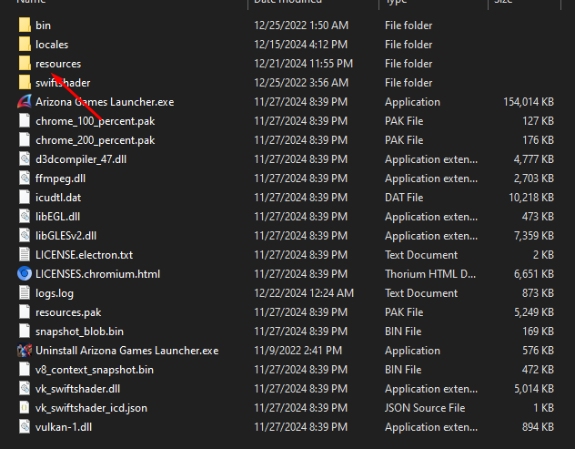
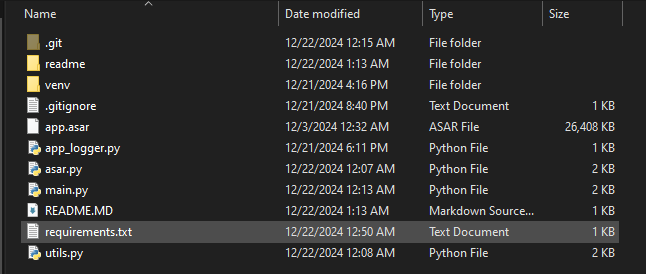
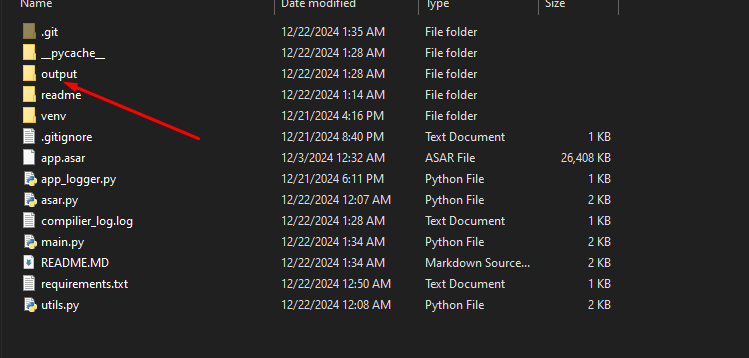
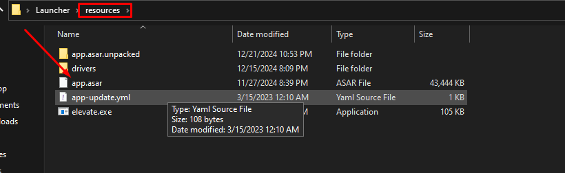

# Arizona Launcher Compiler
Прога написана на питоне, сделана специально для школьников у которых нету денег на лаунчер. Сейчас прога работает только с асаром от користы, Суворов и ориг аризона возможно будут добавлены в будущем.

# Установка и запуск приложения
## Шаг 1. Установите Python3
 Сделайте это либо на офф. [сайте](https://python.org) либо в [Microsoft Store](ms-windows-store://pdp?hl=uk-ua&gl=us&referrer=storeforweb&source=https%3A%2F%2Fapps.microsoft.com%2Fdetail%2F9ncvdn91xzqp%3Fhl%3Den-US%26gl%3DUS&productid=9ncvdn91xzqp&storecid=storeweb-pdp-open-cta&webid=f8e7e7bf-2ca3-489e-80aa-515bd872be7c&websessionid=7b73c923-0511-4cf6-aba6-b4fd22da6a44).
## Шаг 2. Скачайте проект
Для начала нужно скачать проект, это можно сделать по этой [ссылке](https://github.com/Davidshevnya/arzLauncher-complier/archive/refs/heads/main.zip).
Разархивируйте его в любое для вас удобное место, а затем откройте его.
## Шаг 3. Подготовьте app.asar
После этого вам нужен app.asar от лаунчера Користы (на данный момент работает только он), можете достать его из папки лаунчера resources(фото ниже) или скачать [здесь](https://github.com/Davidshevnya/arzLauncher-complier/releases/download/app.asar/app.asar).
<br>Данный файл нужно переместить в папку с файлом main.py.
Вот как это должно выглядеть: 
## Шаг 4. Установка зависимостей и запуск main.py
Откройте командную строку в папке проекта и пропишите две следующих  команды: <br>
### ```pip install -r requirements. txt```<br>
### ```python main.py app.asar```

## Шаг 5. Выберите тип лаунчера и укажите ссылки

## Шаг 6. Запустите лаунчер
Перетащите app.asar из папки output (скрин ниже) в папку лаунчера resources и запустите лаунчер.
